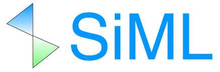

# SiML: A Simulation ML library
SiML is a machine learning library focusing on geometrical and simulation data.
It facilitates machine learning processes, including preprocessing, learning,
and prediction.
In particular, SiML has handy functionalities to handle geometrical data,
which are in graph or point cloud formats in general.

# Documentation
https://ricosjp.github.io/siml

## License

[Apache License 2.0](./LICENSE).
